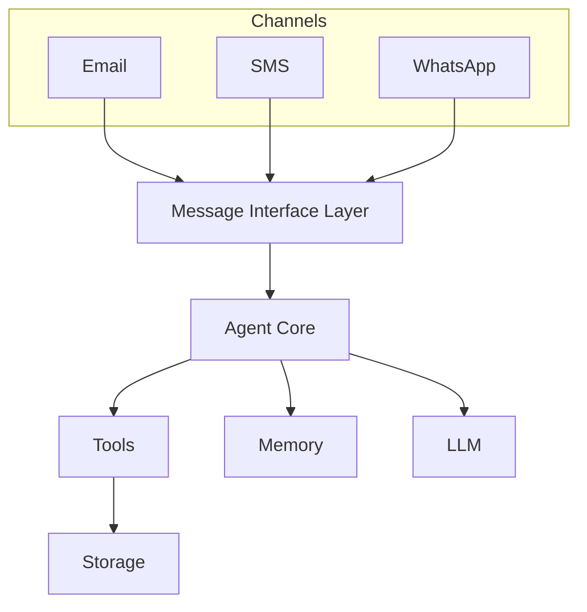

## Requirements
* Must save all input/output from LLM in an encrypted file
* must never share tokens between tools without user prompt
* Detective must inspect and be able to stop all conversation that look dangerous

## Roadmap
* [ ] we need to update the plan as the model go through it
* [ ] add a messaging tools that sends emails
* [ ] add an authenticator tool (security list may require to deterministically contact the user through this to use another tool)
* [ ] add a tool to process rs feeds
* [ ] move tools in separate github repo
* [ ] user should be able to import tools dynamically
* [ ] A tool should be provided to interface with an LLM so that an user can pick the model it wants for an agent
* [ ] Selective add to context
* [ ] Need a security list for what tools other tools can use

## Naming
* Agent: LLM Powered autonomous component
* Tool: Deterministic tool an Agent can use

## Capabilities
* [V] weather service tool https://www.weather.gov/documentation/services-web-api
* [ ] Spawn another agent


## Security Notes
Tools have a list of allow/deny, regardless what the model says, we can deterministically determine if a tool can be executed or in a chain at any point.

## Architecture -- Tentative docs
Current flow:

```
User
  ↓
Planner LLM
  ↓
Execution Loop
  ↓
Tools
  ↓
Final Answer
```

```
Channels
   │
   │  (email / sms / whatsapp)
   ▼
Message Bus / Interface Layer
   ▼
Agent Core
   ▼
Tools
   ▼
Storage
```

SMS → Adapter → Agent
WhatsApp → Adapter → Agent
CLI → Adapter → Agent

(The agent never knows where the message came from but we should keep track of it)




## Channel Message
```
sender = "you@gmail.com"
content = "summarize today's news"
channel = "email"|"sms"|"whatsapp"|"telegram"|
```

## Tools
All tools follow the same interface:
```
tools = {
    "summarize_news": Tool(
        "summarize_news",
        "Summarize today's news",
        summarize_news
    )
}
```

## Channel Interface
Each communication channel implements the same API.
```
receive_messages()
send_message()
```
