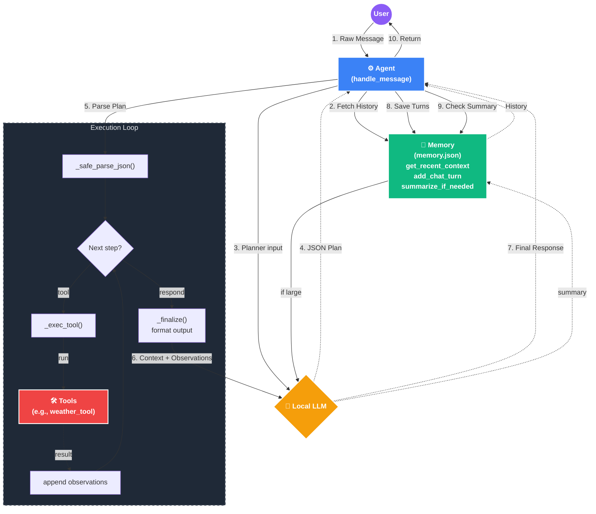

# Snipe
Simple AI personal assistant written from scratch.

## Requirements

## Roadmap
- [ ] JSON Validator with specific format

## Naming
* Agent: LLM Powered autonomous component
* Tool: Deterministic tool an Agent can use

## Capabilities
* [V] weather service tool https://www.weather.gov/documentation/services-web-api
* [ ] 

## Security Notes

## Architecture -- Tentative docs



### Schema
The planner produces a sequence of steps, each step must be one of two types:
* tool
* respond

We force tool input to be structured JSON, not free text.

Example Planner output:
```
{
  "steps": [
    {
      "type": "tool",
      "tool_name": "weather",
      "input": {
        "city": "Boston"
      }
    },
    {
      "type": "respond",
      "thought": "Summarize the weather result for the user."
    }
  ]
}
```

Each tool should describe:
* name
* description
* input schema

This lets the LLM generate valid parameters.

Example Tool Call Generated by Planner:
```
{
  "type": "tool",
  "tool_name": "weather",
  "input": {
    "city": "Boston",
    "date": "2026-04-11"
  }
}
```

Reflection is how the agent decides:
* continue using tools
* or answer the user

Reflection must produce exactly one decision.

Example Reflection Output (continue):
```
{
  "decision": "continue",
  "reason": "Need tomorrow forecast as well.",
  "next_step": {
    "type": "tool",
    "tool_name": "weather",
    "input": {
      "city": "Boston",
      "date": "tomorrow"
    }
  }
}
```

Example Reflection Output (Respond)
```
{
  "decision": "respond",
  "reason": "Enough information gathered to answer the user."
}
```

Agent Flow:
```
User
  ↓
Planner → Plan Schema
  ↓
Execute Tool
  ↓
Reflection → Reflection Schema
  ↓
Continue or Respond
  ↓
Final Response LLM
```