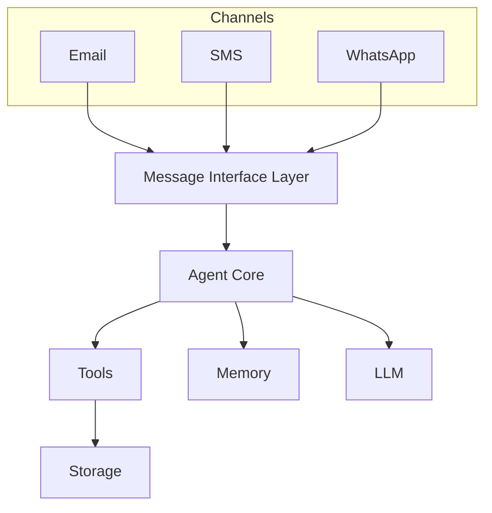

## Requirements
* Must save all input/output from LLM in an encrypted file
* must never share tokens between tools without user prompt
* Detective must inspect and be able to stop all conversation that look dangerous

## Roadmap
* [ ] we need to update the plan as the model go through it
* [ ] add a messaging tools that sends emails
* [ ] add an authenticator tool (security list may require to deterministically contact the user through this to use another tool)
* [ ] add a tool to process rs feeds
* [ ] move tools in separate github repo
* [ ] user should be able to import tools dynamically
* [ ] A tool should be provided to interface with an LLM so that an user can pick the model it wants for an agent
* [ ] Selective add to context
* [ ] Need a security list for what tools other tools can use

## Naming
* Agent: LLM Powered autonomous component
* Tool: Deterministic tool an Agent can use

## Capabilities
* [V] weather service tool https://www.weather.gov/documentation/services-web-api
* [ ] Spawn another agent


## Security Notes
Tools have a list of allow/deny, regardless what the model says, we can deterministically determine if a tool can be executed or in a chain at any point.

## Architecture -- Tentative docs
Current flow:

```
User
  ↓
Planner LLM
  ↓
Execution Loop
  ↓
Tools
  ↓
Final Answer
```

```
Channels
   │
   │  (email / sms / whatsapp)
   ▼
Message Bus / Interface Layer
   ▼
Agent Core
   ▼
Tools
   ▼
Storage
```

SMS → Adapter → Agent
WhatsApp → Adapter → Agent
CLI → Adapter → Agent

(The agent never knows where the message came from but we should keep track of it)


```mermaid
flowchart TD
    %% Define Styles
    classDef user fill:#8b5cf6,stroke:#fff,stroke-width:2px,color:#fff,font-weight:bold
    classDef core fill:#3b82f6,stroke:#fff,stroke-width:2px,color:#fff,font-weight:bold
    classDef llm fill:#f59e0b,stroke:#fff,stroke-width:2px,color:#fff,font-weight:bold
    classDef memory fill:#10b981,stroke:#fff,stroke-width:2px,color:#fff,font-weight:bold
    classDef tool fill:#ef4444,stroke:#fff,stroke-width:2px,color:#fff,font-weight:bold
    classDef loop fill:#1f2937,stroke:#4b5563,stroke-width:2px,color:#e5e7eb,stroke-dasharray: 5 5

    %% Entities
    User((User)):::user
    Agent["⚙️ Agent<br/>(handle_message)"]:::core
    Memory[("💾 Memory<br/>(memory.json)"):- get_recent_context<br/>- add_chat_turn<br/>- summarize_if_needed]:::memory
    LLM{"🧠 Local LLM"}:::llm
    Tools[["🛠️ Tools<br/>(e.g., weather_tool)"]]:::tool

    %% Initial Input
    User -->|1. Raw Message Object| Agent

    %% Phase 1: Context & Planning
    Agent -->|2. Fetch History| Memory
    Memory -.->|History Data| Agent
    
    Agent -->|3. Send planner.yaml<br/>(Tools + History + User Input)| LLM
    LLM -.->|4. Raw JSON Plan| Agent

    %% Phase 2: Execution Loop
    subgraph Execution_Loop [Execution Loop]
        direction TB
        Parse["_safe_parse_json()"] --> LoopCheck{"For each step in plan:"}
        
        LoopCheck -->|"type": "tool"| ExecTool["_exec_tool()"]
        ExecTool -->|Run| Tools
        Tools -.->|Observation / Error| SaveObs["Append to observations[]"]
        SaveObs --> LoopCheck
        
        LoopCheck -->|"type": "respond"| Finalize["_finalize()<br/>Format direct.yaml"]
    end
    class Execution_Loop loop

    Agent -->|5. Pass JSON| Parse
    
    %% Phase 3: Synthesis
    Finalize -->|6. Send Context + Observations| LLM
    LLM -.->|7. Final String Response| Agent

    %% Phase 4: Memory Management
    Agent -->|8. Save User & Assistant turns| Memory
    Agent -->|9. Check Summary Threshold| Memory
    Memory -->|If > 15 turns| LLM
    LLM -.->|Compressed Summary| Memory

    %% Output
    Agent -->|10. Return String| User
```




## Channel Message
```
sender = "you@gmail.com"
content = "summarize today's news"
channel = "email"|"sms"|"whatsapp"|"telegram"|
```

## Tools
All tools follow the same interface:
```
tools = {
    "summarize_news": Tool(
        "summarize_news",
        "Summarize today's news",
        summarize_news
    )
}
```

## Channel Interface
Each communication channel implements the same API.
```
receive_messages()
send_message()
```
